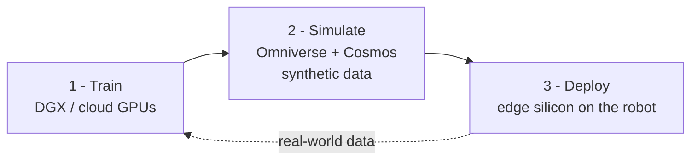
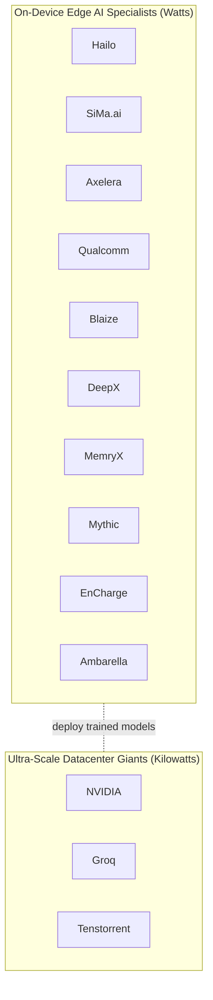

<!--
  BEFORE YOU PUBLISH:
    1. This repo is configured for `Premchand006` in badges, links, and templates.
    2. If you fork it under a different account, update the owner in badges + links,
         then remove the .lycheeignore exception so links get checked.
    3. Replace the social-preview image in repo Settings → "Social preview".
    4. Add the GitHub topics listed in awesome-resources/README.md (Settings → Topics).
-->

<div align="center">

# Awesome Physical AI [](https://awesome.re)

### The companies, chips, and models building machines that perceive, reason, and act in the physical world.

*A vendor-neutral field guide to the Physical-AI hardware landscape: **12 deep company profiles**, a **6-way architecture-philosophy taxonomy**, **aligned comparison tables**, the **VLA and world-foundation models** that drive modern robots, real **applications**, and the **2025–2026 news** — with every vendor-claimed number labeled as such, so it reads like a reference, not a brochure.*

[](LICENSE)
[](https://creativecommons.org/licenses/by/4.0/)
[](CONTRIBUTING.md)
<br/>
[](https://github.com/Premchand006/awesome-physical-ai/actions/workflows/link-check.yml)
[](https://github.com/Premchand006/awesome-physical-ai/actions/workflows/awesome-lint.yml)
[](https://github.com/Premchand006/awesome-physical-ai/commits)
[](https://github.com/Premchand006/awesome-physical-ai/stargazers)

</div>

---

> [!NOTE]
> **Specs and corporate status in this field change monthly.** Every TOPS figure here is a **peak vendor claim at a stated precision** (INT4/INT8/FP4 are *not* comparable); only a handful of parts have independent third-party benchmarks, flagged inline. Recent shifts tracked here: **Groq → NVIDIA** (licensed/acqui-hired), **Blaize** went public, **Mythic** revived with $125M, **Ambarella** exploring a sale. See [**Renames & Deprecations →**](renames-and-deprecations.md).

## 📖 Table of Contents

- [🎯 What This Hub Solves](#-what-this-hub-solves)
- [🧩 What is Physical AI?](#-what-is-physical-ai)
- [🧭 The Two Market Vectors](#-the-two-market-vectors)
- [🧠 Architecture Philosophies](#-architecture-philosophies)
- [🏢 Company Landscape](#-company-landscape)
- [📊 Hardware Comparison](#-hardware-comparison)
- [🤖 VLA and World Models](#-vla-and-world-models)
- [🚀 Applications](#-applications)
- [📈 Future and Market](#-future-and-market)
- [🔁 Renames and Deprecations](#-renames-and-deprecations)
- [📚 Repository Structure](#-repository-structure)
- [🤝 Contributing](#-contributing)
- [📞 Support and Community](#-support-and-community)
- [🙏 Acknowledgements](#-acknowledgements)
- [⭐ Support This Project](#-support-this-project)
- [📄 License](#-license)

> Welcome 👋 — if you're trying to make sense of who builds Physical-AI silicon, how their chips actually differ, and which models run on them, start with the [two market vectors](#-the-two-market-vectors) and the [company landscape](#-company-landscape).

---

## 🎯 What This Hub Solves

*The questions a buyer, builder, or analyst actually asks — answered with sources, not spin.*

The Physical-AI hardware space is loud with marketing TOPS numbers and near-identical "industry-leading" claims. This hub cuts through it:

### 1. "These chips all claim huge TOPS — how do they really differ?"
- They differ in **architecture philosophy**, not headline TOPS. → [Architecture Philosophies](architecture-philosophies/README.md)
- Side-by-side, precision-labeled specs. → [Hardware Comparison](hardware-comparison/README.md)

### 2. "Which company should I take seriously, and what's their actual edge?"
- Twelve **deep profiles** with history, software stack, and a strategic-edge read. → [Company Landscape](companies/README.md)
- A clear split between **edge specialists** and **datacenter giants**. → [The Two Market Vectors](#-the-two-market-vectors)

### 3. "What's hype vs. real — and what just changed?"
- Every vendor figure is **labeled**; independent benchmarks are called out. → [Hardware Comparison](hardware-comparison/README.md)
- A living **renames/deprecations/status** page (Groq→NVIDIA, Blaize public, Coral dead). → [Renames & Deprecations](renames-and-deprecations.md)

### 4. "What models actually run on this hardware?"
- The **VLA policies and world models** driving robots today. → [VLA and World Models](vla-and-world-models/README.md)

---

## 🧩 What is Physical AI?

*The 60-second version. Full treatment in [concepts](concepts/README.md).*

**Physical AI** is AI embedded in machines that **perceive, reason about, and act in the physical world** — robots, autonomous vehicles, drones, industrial automation. Unlike software-only AI, it **closes a loop with the environment** under real-time, safety-critical constraints, so the intelligence has to run **on the machine**.

Vendors frame building such a machine as a **"three-computer" workflow**:



Train large models in the cloud → simulate and generate synthetic data with [world models](vla-and-world-models/README.md) → deploy the [VLA policy](vla-and-world-models/README.md) on [edge silicon](companies/README.md).

---

## 🧭 The Two Market Vectors

The landscape splits into two groups with different goals, power envelopes, and architectures:



- **On-Device Edge AI Specialists** — optimize performance-per-watt to run inference *inside* cameras, robots, cars, and PCs.
- **Ultra-Scale Datacenter Giants** — train and serve the large models that edge devices ultimately run.

---

## 🧠 Architecture Philosophies

The real differentiator is **how each chip beats the "memory wall."** Full explainer: [architecture-philosophies](architecture-philosophies/README.md).

| Philosophy | Who | One-line idea |
|---|---|---|
| **Von Neumann / SIMT GPU** | NVIDIA | massively parallel threads + caches; total generality |
| **Heterogeneous NPU SoC** | Qualcomm, SiMa.ai, Ambarella | matrix engine beside CPU/ISP on one die |
| **Structural dataflow** | Hailo, MemryX, Blaize | map layers to physical nodes; stream on-chip |
| **Digital in-memory (D-IMC)** | Axelera | multiply-accumulate inside SRAM (digital) |
| **Analog in-memory** | EnCharge, Mythic | math in the analog domain; weights on-chip |
| **Deterministic LPU** | Groq | compiler schedules every op; no caches |
| **RISC-V tensor grid** | Tenstorrent | open, programmable RISC-V + matrix cores |

---

## 🏢 Company Landscape

Deep profiles with verified specs and 2025–2026 news in [companies/](companies/README.md).

### On-Device Edge AI Specialists
| Brand | Software stack (CUDA equivalent) | Core architecture | Target environment | Strategic edge |
|---|---|---|---|---|
| [Hailo](companies/hailo.md) | Hailo AI Software Suite | Structural dataflow NPU | Smart cameras, automotive, retail | Best perf/watt for CV; mature ecosystem |
| [SiMa.ai](companies/sima-ai.md) | Palette + Edgematic | Heterogeneous MLSoC | Robotics, industrial, defense | Legacy C/C++ + AI on one SoC |
| [Axelera](companies/axelera.md) | Voyager SDK (TVM + GStreamer) | Digital in-memory (D-IMC) | Multi-stream vision, enterprise edge | Cost-to-performance at many streams |
| [Qualcomm](companies/qualcomm.md) | Qualcomm AI Stack / AI Hub | Hexagon NPU | Mobile / PC / automotive / DC | Horizontal scale across devices |
| [Blaize](companies/blaize.md) | AI Studio + Picasso | Graph Streaming Processor | Automotive, security, smart city | Programmable graph-native dataflow |
| [DeepX](companies/deepx.md) | DXNN | Heterogeneous NPU | Robotics, IP cameras, AI PCs | TOPS/watt; "intelligent quantization" |
| [MemryX](companies/memryx.md) | MemryX SDK (open source) | At-memory dataflow | Developer / edge vision | Easiest to adopt; open SDK |
| [Mythic](companies/mythic.md) | Mythic ACE | Analog compute-in-memory | Edge vision, defense | Analog efficiency; weights on-chip |
| [EnCharge](companies/encharge.md) | EnCharge suite | Analog charge-domain IMC | AI PCs, laptops, workstations | ~20× perf/watt (claimed) |
| [Ambarella](companies/ambarella.md) | CVflow / Cooper | CVflow vision SoC | Security cameras, automotive, AMRs | Video + AI in one low-power SoC |

### Ultra-Scale Datacenter Giants
| Brand | Software stack | Core architecture | Target environment | Strategic edge |
|---|---|---|---|---|
| [NVIDIA](companies/nvidia.md) | CUDA + TensorRT / JetPack | SIMT GPU + Tensor Cores | Cloud + robotics edge | Full-stack moat; 2.2M+ developers |
| [Groq](companies/datacenter-context.md) | GroqCompiler | Deterministic LPU | Datacenter LLM inference | Lowest-latency tokens |
| [Tenstorrent](companies/datacenter-context.md) | TT-Metalium / TT-Buda | RISC-V Tensix grid | Datacenter training/inference | Open-source bare-metal kernels |

---

## 📊 Hardware Comparison

A taste of the flagship parts; full precision-labeled tables and caveats in [hardware-comparison/](hardware-comparison/README.md).

| Company | Flagship | AI perf (vendor) | Precision | Power | Memory |
|---|---|---|---|---|---|
| [NVIDIA](companies/nvidia.md) | Jetson AGX Thor | up to 2,070 TFLOPS | FP4 | 40–130 W | 128 GB |
| [Hailo](companies/hailo.md) | Hailo-10H | 40 / 20 TOPS | INT4 / INT8 | ~2.5 W | 4–8 GB on-module |
| [Axelera](companies/axelera.md) | Europa (2026) | 629 TOPS | INT8 | card | 128 MB SRAM |
| [EnCharge](companies/encharge.md) | EN100 (M.2) | 200+ TOPS | analog | 8.25 W | up to 128 GB |
| [SiMa.ai](companies/sima-ai.md) | Modalix | 50 TOPS | BF16 + INT8/16 | <10 W | on-chip |
| [Mythic](companies/mythic.md) | M1076 | 25 TOPS | analog | 3 W | 80M weights on-chip |
| [DeepX](companies/deepx.md) | DX-M1 | 25 TOPS | INT8 | 3–5 W | — |

> Only **MemryX** (Phoronix), **Hailo-10H** (CNX Software), and **Groq** (~241 tok/s, Llama-2-70B) currently have genuinely independent third-party numbers. Everything else is **vendor-claimed**.

---

## 🤖 VLA and World Models

The "brain" side of Physical AI — full coverage in [vla-and-world-models/](vla-and-world-models/README.md).

- **Vision-Language-Action (VLA) models** turn camera images + instructions into robot actions: **RT-2**, **OpenVLA** (7B, open), **π0**, **Diffusion Policy**, **ACT**, **SmolVLA** (450M), **NVIDIA Isaac GR00T N1.5**.
- **World foundation models** simulate reality and generate synthetic training data: **NVIDIA Cosmos** (Predict / Transfer / Reason).
- **[LeRobot](https://github.com/huggingface/lerobot)** (Hugging Face) is the open library that ties policies, datasets, and checkpoints together.

---

## 🚀 Applications

Where it's deployed — full table in [applications/](applications/README.md).

| Vertical | What Physical AI does | Maturity |
|---|---|---|
| Humanoid robots | manipulation, locomotion, VLA policies | early, fast-moving |
| AMRs / logistics | warehouse navigation, picking | deployed at scale |
| Manufacturing | defect detection, predictive maintenance | mature, fastest-growing |
| Automotive | perception, ADAS, autonomous trucking | large, sustained |
| Smart cities / security | video analytics, anomaly detection | steady |
| Healthcare / surgical | surgical robotics, monitoring | high-value, regulated |

---

## 📈 Future and Market

Why this is widely seen as the next frontier — with honest caveats — in [future-and-market/](future-and-market/README.md).

- The thesis: foundation models + simulation + edge compute matured at once, opening a path to general-purpose robots ("the ChatGPT moment for robotics," per NVIDIA's CES 2025 keynote).
- **Market size estimates diverge by 10×+** by definition — from ~$0.89B to ~$81B in 2025 across analysts. Use the **range**, cite scope + source + year.
- Goldman Sachs projects **cumulative humanoid investment >$50B by 2030**.

---

## 🔁 Renames and Deprecations

What changed in 2024–2026 — don't act on stale info. Full page: [renames-and-deprecations.md](renames-and-deprecations.md).

| If a source says… | Today it's… |
|---|---|
| "Groq (independent)" | **NVIDIA Groq** (licensed + acqui-hired, Dec 2025; contested) |
| "Blaize, the startup" | **public company** (NASDAQ: BZAI) |
| "buy a Coral / Edge TPU" | **effectively abandoned** — use Hailo |
| "Raspberry Pi AI Kit" | **AI HAT+ / AI HAT+ 2** (Hailo) |
| "TensorFlow Lite" | **LiteRT** |
| "OpenVINO Model Optimizer" | **OVC** + `optimum-intel` |

---

## 📚 Repository Structure

```text
awesome-physical-ai/
├── concepts/                  # what Physical AI is; the three-computer workflow
├── architecture-philosophies/ # SIMT, dataflow, D-IMC, analog IMC, LPU, RISC-V grid
├── companies/                 # 12 deep profiles + Groq/Tenstorrent context + master tables
├── hardware-comparison/       # side-by-side specs, vendor vs independent benchmarks
├── vla-and-world-models/      # OpenVLA, pi0, SmolVLA, GR00T, Cosmos, LeRobot
├── applications/              # use cases by vertical
├── future-and-market/         # why it's growing; sourced market ranges; milestones
├── awesome-resources/         # curated links (SDKs, papers, robot-learning, benchmarks)
└── renames-and-deprecations.md
```

### Explore by section
- 🧩 **[Concepts](concepts/README.md)** — the vocabulary and the three-computer workflow.
- 🧠 **[Architecture Philosophies](architecture-philosophies/README.md)** — how the chips really differ.
- 🏢 **[Companies](companies/README.md)** — 12 deep profiles + the master comparison.
- 📊 **[Hardware Comparison](hardware-comparison/README.md)** — precision-labeled spec tables.
- 🤖 **[VLA & World Models](vla-and-world-models/README.md)** — the models that drive robots.
- 🚀 **[Applications](applications/README.md)** — deployments by vertical.
- 📈 **[Future & Market](future-and-market/README.md)** — the growth thesis and the numbers.
- ⭐ **[Awesome Resources](awesome-resources/README.md)** — the curated link collection.

---

## 🤝 Contributing

This map is only as good as the community keeps it. **Great contributions:** correct a spec (with a dated primary source), add verified news, flag a status change, or add a high-signal resource. The quality bar is in **[CONTRIBUTING.md](CONTRIBUTING.md)**, and CI runs `awesome-lint` + a link checker on every PR.

**Quality standards:** cite a primary source with a date; label vendor claims; state precision for any TOPS figure; stay vendor-neutral.

Look for [`good first issue`](https://github.com/Premchand006/awesome-physical-ai/labels/good%20first%20issue) and [`help wanted`](https://github.com/Premchand006/awesome-physical-ai/labels/help%20wanted).

## 📞 Support and Community

- 🐛 **Issues** — correct a spec, flag a status change, or report a dead link (templates provided).
- 💡 **Discussions / PRs** — propose a company, product, or resource; see [CONTRIBUTING.md](CONTRIBUTING.md).
- 🔁 **Spot something outdated?** — in a field this fast, fixing a stale number is the most valuable thing you can do.

---

## 🙏 Acknowledgements

Built in the spirit of the [Awesome](https://awesome.re) movement and the wider edge-AI and robotics communities. All product names and trademarks belong to their respective owners; this is an independent, vendor-neutral resource, and every figure is sourced or labeled as a vendor claim.

## ⭐ Support This Project

- ⭐ **Star** the repo so more builders and analysts find it.
- 🔗 **Share** it with someone comparing edge-AI silicon.
- 🤝 **Contribute** a corrected spec, a dated news item, or a new profile.

## 📄 License

Prose/tables: **CC BY 4.0**. Code/snippets: **MIT**. See [LICENSE](LICENSE).

---

<div align="center">

**Mapping the machines that act in the real world — one sourced fact at a time.**
*Vendor-neutral • Precision-labeled • Community-curated*

</div>
