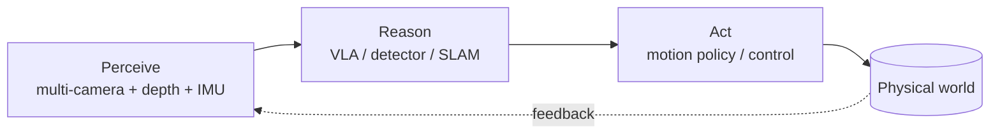

# Applications & Use Cases

Where Physical AI is actually being deployed, by vertical. Each row pairs the use case with the kind of hardware ([companies](../companies/README.md)) and models ([VLA & world models](../vla-and-world-models/README.md)) behind it.

## By vertical
| Vertical | What Physical AI does | Typical compute | Maturity |
|---|---|---|---|
| **Humanoid robots** | general-purpose manipulation, locomotion, VLA policies | Jetson Thor, GR00T N1.5 | early, fast-moving |
| **Autonomous mobile robots (AMRs)** | warehouse logistics, navigation, picking | Jetson, SiMa.ai, Hailo | deployed at scale |
| **Manufacturing** | defect detection, predictive maintenance, robotic assembly | Hailo, Axelera, SiMa.ai | mature, fastest-growing vertical |
| **Automotive / autonomous** | perception, driver monitoring, ADAS, autonomous trucking | Ambarella, Qualcomm, NVIDIA | large, sustained |
| **Drones / UAVs** | inspection, mapping, delivery, obstacle avoidance | Jetson, Hailo | growing |
| **Smart cities / security** | video analytics, traffic, anomaly detection | Ambarella, Hailo, Axelera | steady; privacy pushes inference on-device |
| **Healthcare / surgical** | surgical robotics, monitoring, imaging | NVIDIA Holoscan, edge SoCs | high-value, regulated |
| **Retail** | checkout-free, footfall, shelf analytics | Hailo, Qualcomm | major CV adopter |
| **Agriculture** | crop monitoring, autonomous machinery, yield analysis | Jetson, edge NPUs | emerging |

## Flagship real-world examples
- **Humanoids:** Figure (Helix dual-system VLA), Tesla Optimus, Unitree G1, **Boston Dynamics Atlas** (all-electric, runs Jetson Thor), Agility Digit.
- **Autonomous trucking:** Kodiak Robotics builds on Ambarella edge SoCs.
- **Surgical robotics:** Intuitive, CMR Surgical, Medtronic platforms increasingly use edge AI for real-time guidance.
- **Logistics:** Amazon and others run large AMR fleets with on-device perception.

## Why on-device, not cloud
Every one of these closes a **real-time control loop** and handles **sensitive data** (faces, patients, factory IP, road scenes). They need bounded latency, privacy, and offline resilience — exactly the case for edge inference made in [concepts](../concepts/README.md).

## The pattern across verticals

➡️ Why this is a high-growth frontier, with market figures: [future-and-market](../future-and-market/README.md).
