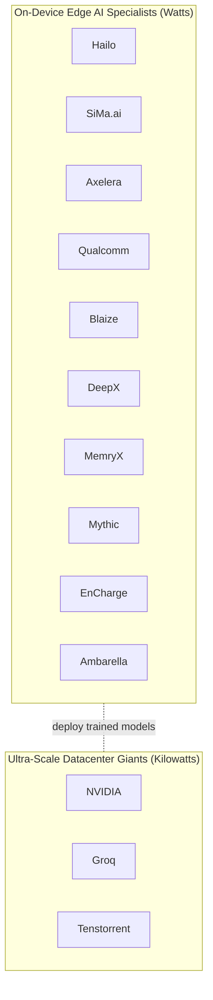

# Companies & Products

The Physical-AI silicon landscape, company by company. Each profile covers history, **architecture philosophy**, flagship products with **verified specs**, the proprietary software stack (the "CUDA equivalent"), target market, the standout strategic edge, and **the latest credible 2025–2026 news** — with every vendor-claimed number labeled as such.

> **How to read the spec tables:** every TOPS figure is a **peak vendor claim at a stated precision**. INT4, INT8, and FP4 numbers are **not** directly comparable. Only a few parts have genuinely independent third-party benchmarks (noted inline). See [../hardware-comparison/README.md](../hardware-comparison/README.md) for a side-by-side.

## Two vectors of the market

The field splits cleanly into two groups with different goals, power envelopes, and architectures:

## Architecture philosophies at a glance
The fundamental division is **how each chip handles the math** (full taxonomy in [../architecture-philosophies/README.md](../architecture-philosophies/README.md)):

- **Von Neumann / SIMT GPU** — NVIDIA. Massively parallel threads, data shuttled through caches to cores.
- **Heterogeneous NPU SoC** — Qualcomm, SiMa.ai, Ambarella. Fixed-function matrix engines beside CPUs/ISPs.
- **Structural dataflow** — Hailo, MemryX, Blaize. Network layers mapped to physical nodes; activations stream on-chip.
- **Digital in-memory computing (D-IMC)** — Axelera. Matrix math inside SRAM cells (digital).
- **Analog in-memory computing** — EnCharge (charge-domain), Mythic (flash). Math in the analog domain; all weights on-chip.
- **Deterministic LPU** — Groq. Compiler schedules every operation; no caches/branch prediction.
- **RISC-V tensor grid** — Tenstorrent. Programmable RISC-V + matrix cores; open bare-metal kernels.

## Master landscape comparison

### On-Device Edge AI Specialists
| Brand | Software stack (CUDA equivalent) | Core architecture | Target environment | Strategic edge |
|---|---|---|---|---|
| [Hailo](hailo.md) | Hailo AI Software Suite | Structural dataflow NPU | Smart cameras, automotive, retail | Best perf/watt for CV; mature ecosystem |
| [SiMa.ai](sima-ai.md) | Palette + Edgematic | Heterogeneous MLSoC | Robotics, industrial, defense | Legacy C/C++ + AI on one SoC |
| [Axelera](axelera.md) | Voyager SDK (TVM + GStreamer) | Digital in-memory (D-IMC) | Multi-stream vision, enterprise edge | Cost-to-performance for many streams |
| [Qualcomm](qualcomm.md) | Qualcomm AI Stack / AI Hub | Hexagon NPU | Mobile / PC / automotive / DC | Horizontal scale across devices |
| [Blaize](blaize.md) | AI Studio + Picasso | Graph Streaming Processor | Automotive, security, smart city | Programmable graph-native dataflow |
| [DeepX](deepx.md) | DXNN | Heterogeneous NPU | Robotics, IP cameras, AI PCs | TOPS/watt; "intelligent quantization" |
| [MemryX](memryx.md) | MemryX SDK (open source) | At-memory dataflow | Developer / edge vision | Easiest to adopt; open SDK |
| [Mythic](mythic.md) | Mythic ACE | Analog compute-in-memory | Edge vision, defense | Analog efficiency; weights on-chip |
| [EnCharge](encharge.md) | EnCharge suite | Analog charge-domain IMC | AI PCs, laptops, workstations | ~20× perf/watt (claimed) |
| [Ambarella](ambarella.md) | CVflow / Cooper | CVflow vision SoC | Security cameras, automotive, AMRs | Video + AI in one low-power SoC |

### Ultra-Scale Datacenter Giants
| Brand | Software stack | Core architecture | Target environment | Strategic edge |
|---|---|---|---|---|
| [NVIDIA](nvidia.md) | CUDA + TensorRT / JetPack | SIMT GPU + Tensor Cores | Cloud + robotics edge | Full-stack moat; 2.2M+ developers |
| [Groq](datacenter-context.md) | GroqCompiler | Deterministic LPU | Datacenter LLM inference | Lowest-latency tokens |
| [Tenstorrent](datacenter-context.md) | TT-Metalium / TT-Buda | RISC-V Tensix grid | Datacenter training/inference | Open-source bare-metal kernels |

## Profiles
**Edge specialists:** [Hailo](hailo.md) · [SiMa.ai](sima-ai.md) · [Axelera](axelera.md) · [Qualcomm](qualcomm.md) · [Blaize](blaize.md) · [DeepX](deepx.md) · [MemryX](memryx.md) · [Mythic](mythic.md) · [EnCharge](encharge.md) · [Ambarella](ambarella.md)
**Datacenter / context:** [NVIDIA](nvidia.md) · [Groq & Tenstorrent](datacenter-context.md)

➡️ Next: side-by-side specs in [hardware-comparison](../hardware-comparison/README.md), or the models these chips run in [vla-and-world-models](../vla-and-world-models/README.md).
