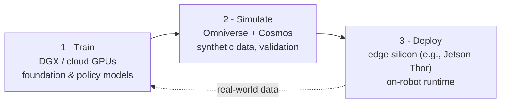
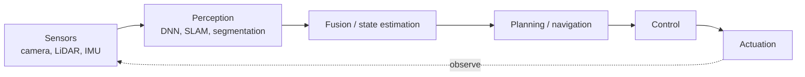

# Concepts — What Physical AI Actually Is

Physical AI is the branch of artificial intelligence concerned with machines that **perceive, reason about, and act in the physical world**: humanoid and mobile robots, autonomous vehicles, drones, and industrial automation. What separates it from ordinary "edge inference" is that the system **closes a loop with its environment** — sense, decide, actuate, observe the result, repeat.

## The defining shift: from software AI to embodied AI
The first wave of modern AI lived entirely in software — text, images, code. Physical AI is the second wave: the same large-model techniques (transformers, diffusion, vision-language models) are now driving **actuators and wheels and grippers**, under hard real-time and safety constraints. The intelligence has to run *on the machine*, because a robot cannot wait on a network round-trip to avoid a collision.

## Cloud vs Edge vs Embedded (the constraint envelope)
| | Cloud AI | Edge AI | Embedded AI |
|---|---|---|---|
| **Where inference runs** | Datacenter | On/near the device | Microcontroller/DSP |
| **Latency** | 10s–100s ms | single-digit–low-tens ms | deterministic, often <1 ms |
| **Data** | leaves device | stays local | stays local |
| **Power** | unlimited | Watts | milliwatts |

Physical AI spans all three: a robot is **trained** in the cloud, **simulated** in the cloud, and **deployed** at the edge.

## The "three-computer" workflow
Vendors — most explicitly NVIDIA — frame building an intelligent machine as three cooperating computers:

1. **Train** large models on cloud GPUs.
2. **Simulate** in a physics-accurate world and generate **synthetic data** to cover rare or dangerous situations — increasingly using **world foundation models** ([Cosmos](../vla-and-world-models/README.md)).
3. **Deploy** the runtime policy on edge silicon inside the robot.

## Why latency and on-device inference matter
- **Real-time control loops** need bounded, deterministic latency (high-end platforms target multi-sensor fusion well under ~10 ms).
- **Privacy** — camera and sensor data never has to leave the machine.
- **Bandwidth & cost** — send decisions, not raw video.
- **Availability** — the robot keeps working without connectivity.

## The robotics stack

➡️ See [architecture-philosophies](../architecture-philosophies/README.md) for how the silicon differs, or [vla-and-world-models](../vla-and-world-models/README.md) for the models that now drive the "decide" step.
